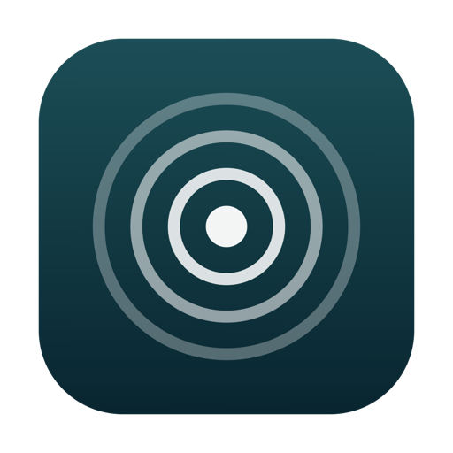
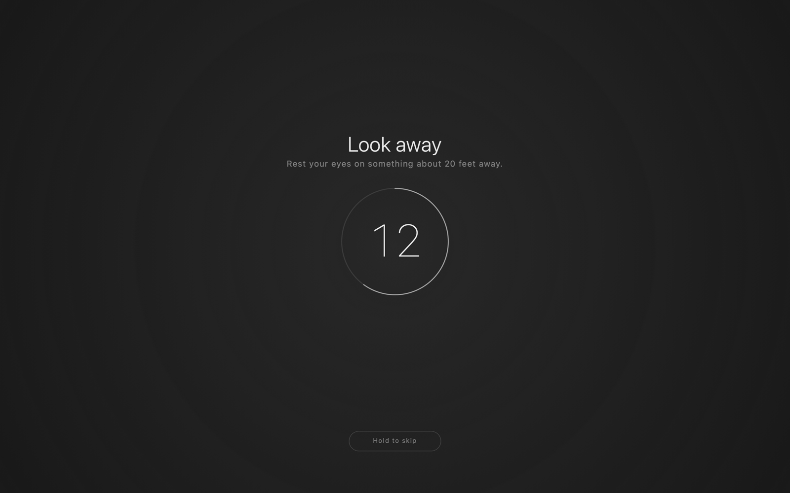

<div align="center">



# 20-20-20

**Every 20 minutes, look at something 20 feet away for 20 seconds.**
A macOS menu bar app that makes the rule hard to ignore and easy to live with.

[](https://github.com/lukaske/202020/releases/latest/download/202020.app.zip)

[](https://www.apple.com/macos/)
[](https://swift.org)
[](LICENSE)
[](#building)



</div>

## Why

Reminders get dismissed. This one covers every display instead — nothing to read,
nothing to do, no reason not to look out of the window.

**And you don't have to watch it.** A soft falling chime plays when the break
starts and a brighter rising one when it ends, so you can turn your head, rest
your eyes properly, and let the sound tell you when it's safe to look back.

## Install

[Download](https://github.com/lukaske/202020/releases/latest/download/202020.app.zip),
unzip, drag to `/Applications`. It's ad-hoc signed rather than notarized, so the
first launch needs **right-click → Open** once. Or build it and skip that:

```sh
git clone https://github.com/lukaske/202020.git && cd 202020 && ./build.sh --install
```

Then: eye icon → **Settings → Start at login** — after the app is in its final
location, since macOS records where it was when you registered it.

## The menu

| | |
|---|---|
| **Eye breaks** | The on/off switch. Off means no timers at all. |
| **Take a break now** | Start one immediately. |
| **Mute sounds** | Silences both chimes. Breaks still happen — muting isn't switching it off. |
| **Volume** | Let go of the knob and it plays the "look back" tone, so you hear what you picked. |
| **Settings** | Interval (15–60 min), break length (20–60 s), screen cover, menu-bar countdown, start at login. |

**Skipping.** The overlay has a *Hold to skip* button, and `esc` does the same —
either way it takes a deliberate 1.5-second hold, so a stray click does nothing.
It's a plain grey outline parked well away from the countdown: findable when you
need it, ignorable when you don't. Skipping doesn't buy you a longer stretch
before the next break.

**Staying out of the way.** Breaks are dropped rather than queued if you were away
from the keyboard, or the screen was locked or asleep — so you never come back to
a screen full of overlay. All displays are covered, so you can't just look at the
other monitor.

## Battery

It runs all day, so waiting costs nothing: **one timer scheduled directly on the
next break** with a 30-second tolerance, not a per-second poll. Second-by-second
updates run only while the menu is open, the optional menu-bar countdown ticks
every 15 seconds, and switching it off invalidates every timer. During a break the
overlay repaints a small centred view at 10 fps, never the whole display.

Measured: **0.00 s of CPU over 120 s idle**, ~44 MB resident.

## Building

Needs macOS 13+ and the Command Line Tools (`xcode-select --install`). No Xcode
project, no package manager, no dependencies — `build.sh` compiles, lays out the
bundle, draws the icon and ad-hoc signs it.

```sh
./build.sh            # build into ./build/202020.app
./build.sh --install  # build, replace /Applications copy, relaunch
```

```
Sources/
  main.swift               entry point
  AppDelegate.swift        status item + menu
  BreakController.swift    the cycle, timers, sleep/idle handling
  OverlayController.swift  the windows, one per display
  BreakView.swift          overlay drawing + the hold-to-skip gesture
  Chime.swift              the two signals, synthesised as WAV in memory
  Preferences.swift        UserDefaults
  SwitchMenuItemView.swift the on/off switch in the menu
  VolumeMenuItemView.swift the volume slider in the menu
  LaunchAtLogin.swift      SMAppService login item
Tools/MakeIcon.swift       draws the app icon at build time
```

Three details that look odd until you know why: the chimes are **synthesised** as
decaying sine partials into an in-memory WAV, so they sound identical everywhere
and there's nothing to ship; the volume slider position is **squared** to get an
amplitude, because a linear one crowds every useful level into the last third of
its travel; and the countdown digits are centred on their **cap height**, not
their line box, which reserves descender space they don't use and would sit them
visibly low in the ring.

## License

[MIT](LICENSE) © Luka Skeledzija
